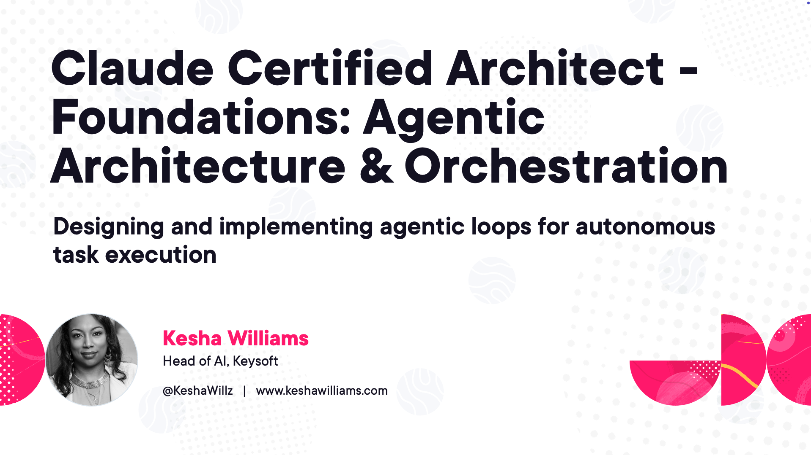

# Claude Certified Architect - Foundations: Agentic Architecture & Orchestration



This is the companion repo for Claude Certified Architect - Foundations: Agentic Architecture & Orchestration on Pluralsight. It covers Domain 1 of the CCAR-F exam, the largest at 27 percent: agentic loops, multi-agent coordination, subagent context passing, programmatic enforcement with hooks, task decomposition, and session resumption and forking.

Each module has demo code you'll watch being built in the course, a hands-on challenge with a broken starter to fix, a worked solution, and a self-check with exam-style questions. Everything runs in GitHub Codespaces with one secret, your `ANTHROPIC_API_KEY`.

This repo is not affiliated with or endorsed by Anthropic. The CCAR-F exam guide is Anthropic's; the code and questions here are original course material.

## Run it in GitHub Codespaces (recommended)

1. Add your API key as a Codespaces secret named `ANTHROPIC_API_KEY`
   (GitHub → Settings → Codespaces → Secrets), or accept the prompt when the
   Codespace starts.
2. Click **Code → Create codespace on main**.
3. Wait for the container to build. Dependencies install automatically.
4. Open a terminal and run any demo, for example:

   ```bash
   cd module-01-agentic-loops/demo-support-agent-loop
   python agent.py
   ```

No virtual environment needed. The container is the isolation.

## Run it locally

```bash
python -m venv .venv && source .venv/bin/activate
pip install -r requirements.txt
export ANTHROPIC_API_KEY=sk-ant-...
```

Python 3.10 or later. The devcontainer uses 3.12.

Module 7 has you type `claude` directly in a terminal, so you'll need the CLI
on your PATH for that module:

```bash
npm install -g @anthropic-ai/claude-code
```

Everything else uses the Claude Agent SDK, which ships its own copy of the CLI.
Module 1 doesn't use the SDK at all; it runs on the `anthropic` package alone.

## Repo layout

```
module-01-agentic-loops/       Task 1.1: the agentic loop and stop_reason
module-02-multi-agent/         Task 1.2: coordinator-subagent patterns
module-03-subagent-invocation/ Task 1.3: spawning, context passing, parallelism
module-04-enforcement-handoff/ Task 1.4: hooks as gates, multi-issue, handoffs
module-05-hooks/               Task 1.5: PostToolUse normalization, PreToolUse blocks
module-06-task-decomposition/  Task 1.6: prompt chaining vs dynamic decomposition
module-07-sessions/            Task 1.7: resume, fork, start fresh

check_conventions.py           Run before packaging; catches drift across files
```

Each module folder has demo folders, a challenge folder with a `solutions/`
subfolder, a README with the clip-to-folder map, and a `self-check.md` with
four exam-style questions.

Module 1 stays on the raw Messages API on purpose, so you see the loop the SDK
runs for you from Module 2 onward. Modules 4 and 5 add hooks to Module 1's
support agent, rebuilt as SDK tools. Modules 6 and 7 work on small codebases
checked into the repo.

## Running the code

Every demo and challenge expects to be run from inside its own folder. Scripts
reference sibling folders with relative paths, so `cd` into the folder first.
Solution files run from inside `solutions/`.

## Code style

The Python is deliberately beginner-level: plain loops, explicit if/elif,
no clever idioms. If you're new to Python, nothing in this repo should make
you stop and decode the language. The agent patterns carry the lesson.

## Model and versions

All code pins `claude-sonnet-5`, `anthropic==1.2.0`, and
`claude-agent-sdk==0.2.152`. Sonnet 5 runs adaptive thinking by default and
rejects non-default sampling parameters (`temperature`, `top_p`, `top_k`
return a 400), so the demos set neither.

## Cost note

The demos make a handful of short API calls per run. A full run of every
demo and challenge in the course costs a few dollars at Sonnet 5 pricing.
Module 1 alone is a few cents.